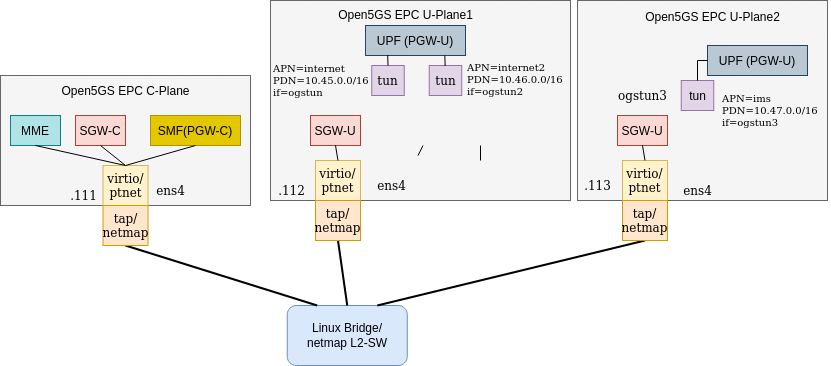

# Disaggregated Open5Gs in KVM guests

This is a deployment of an [Open5Gs](https://open5gs.org/) in separated KVM guests. This deployment is based on [Overview of Open5GS CUPS-enabled EPC Simulation Mobile Network](https://github.com/s5uishida/open5gs_epc_oai_sample_config). Check it for complete details about the deployment.

This document is detailed the networking and the configuration of the KVM guests in order to be able to use [netmap](https://github.com/luigirizzo/netmap), as well of the automation of the deployment via bash scripts. 

## Dependencies

The KVM guests will be deployed via a QEMU-KVM netmap-enabled fork. To install it:

Build and install qemu with netmap support on the host machine.

```source
git clone https://github.com/netmap-unipi/qemu
cd qemu
./configure --target-list=x86_64-softmmu --enable-kvm --disable-werror --enable-netmap 
make
sudo make install
```

## Disaggregated Open5Gs in KVM guests on the same physical host



There are two available types of networking: `normal` and `netmap`. The `normal` deployment follows a typical VM networking configuration by running a `virtio` driver as virtual NIC, a `tap` device as networking backend and finally a `linux-bridge` device as networking bridge. On the other hand, the `netmap` deployment uses the `ptnet` driver as virtual NIC, a `netmap-pipe` device as networking backend and finally a layer 2 switch implemented from scratch as networking bridge.

### TL;DR

```source
# Do same procedure for every VM (vm1, vm2, vm3)
(host) $ sudo build_vms.sh vmX [normal|netmap]
(host) $ ssh ubuntu@localhost -p 202X
(guest) $ git clone https://github.com/sergio-gimenez/disaggregated-Open5GS.git
(guest) $ cd disaggregated-Open5GS
(guest) $ ./setup_vms.sh  vmX setup-net

# Start the desired Open5GS services in each guest (vm1, vm2, vm3)
(guest) $ ./start_vms.sh  vmX start

# Enable networking by running a bridge/netmap-l2-switch in the host

# normal networking:
(host) $ sudo setup_nost_net.sh

#netmap networking:
(host) $ sudo l2-switch -i vale1:01}1 -i vale1:02}1 -i vale1:03}1
# Switch needs to be compiled from source in from the RINA-OpenVerso repo
```

### Step by step deployment

Let's start first building the VMs. To do so, run the `build_vms.sh` script as root. This will install the needed dependencies as well as the ubuntu cloud base image to build the VM from a pre-created image. If everything is ok, the script will create the VMs and start them in a new window. The credentials of the VM can be specified in the `user_data.yaml` file.

Now, ssh into the VM. In order to do so, run the following command:

```source
ssh ubuntu@localhost -p 202X
```

Where `X` is the VM number. For example, if we built the `vm1`, then the ssh query to access it will be `ssh ubuntu@localhost -p 2021`. Note also that `ubuntu` is the default user name for ubuntu cloud-images.

Once inside the VM, first of all clone the repo and then we have to first install netmap (only if we want to use the netmap networking version). To install netmap, run the following script **without being root**.

```source
./install_netmap.sh
```

This will compile and insert the netmap kernel module into the VM in order to enable netmap-passthrough (i.e., make the guest-host communication using netmap work).

Once netmap is installed, we can setup the networking. To do so, run the following script:

```source
sudo ./setup_vms.sh [vm1 vm2 vm3] [setup-net start]
```

* The `setup-net` option will start the needed networking. (More details on what's going on under the hood [here](https://github.com/s5uishida/open5gs_epc_oai_sample_config#changes-in-configuration-files-of-open5gs-epc-and-oai-ue--ran))

* The `start` option will start Open5Gs.

Finally, we need to enable the L2 network in the host.  For the `normal` networking, you just have to run the following script:

```source
sudo ./setup_host_net.sh
```

For the `netmap` networking, the `l2-switch` must be compiled from source and then executed.

## Disaggregated Open5Gs in KVM guests on different physical hosts

References used and nice to check:

* [Open5GS Quickstart](https://open5gs.org/open5gs/docs/guide/01-quickstart/)
* [Building Open5GS from sources](https://open5gs.org/open5gs/docs/guide/02-building-open5gs-from-sources/)
* [Boot Ubuntu providing it network config in NoCloud Datasource](https://gist.github.com/smoser/635897f845f7cb56c0a7ac3018a4f476)
* [Open5GS EPC & OpenAirInterface UE / RAN Sample Configuration](https://github.com/s5uishida/open5gs_epc_oai_sample_config)